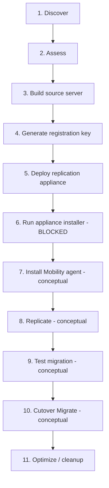

# On-Prem to Azure VM Migration Lab

Hands-on lab simulating an on-prem-to-Azure server migration using Azure Migrate's agent-based (physical/other) method, as part of Azure/DevOps interview prep.

## Environment

- Resource group: `migration-lab-rg` (Central US)
- Azure Migrate project: `vm-migration-lab`
- Simulated on-prem source server: `onprem-vm` (Ubuntu 24.04)
- Replication appliance (attempted): `repl-appliance-vm` (Windows Server 2025)

## Step-by-Step Summary

| # | Stage | What we did | Status |
|---|-------|-------------|--------|
| 1 | Discover | Created `migration-lab-rg` and the `vm-migration-lab` Azure Migrate project. | Done |
| 2 | Assess | Set migration target as Azure VM, source type Physical/other, target region Central US. | Done |
| 3 | Build source server | Deployed `onprem-vm` (Ubuntu 24.04) as the simulated on-prem server. | Done |
| 4 | Generate registration key | Generated the appliance registration key, which silently provisioned the Recovery Services vault. | Done |
| 5 | Deploy replication appliance | Deployed `repl-appliance-vm` (Windows Server 2025) to act as the relay between source and Azure. | Done |
| 6 | Run appliance installer | Ran `DRInstaller.ps1` — blocked by a prerequisite check requiring Windows Server 2022, not 2025. | Blocked |
| 7 | Install Mobility agent | The appliance would push-install the Mobility agent on the source server using its provided credentials. | Conceptual |
| 8 | Replicate | Full block-level disk copy, followed by continuous delta replication into Azure Managed Disks. | Conceptual |
| 9 | Test migration | Azure boots a temporary VM from the replica in an isolated network for validation, then it's manually cleaned up. | Conceptual |
| 10 | Cutover (Migrate) | Final delta sync, then Azure auto-creates the permanent target VM from the replicated disks. | Conceptual |
| 11 | Optimize / cleanup | Deleted `repl-appliance-vm` and its leftover networking resources; stopped/deallocated `onprem-vm`. | Done |

## Flow Chart

## Key Takeaway

Every stage transition in Azure Migrate is manually triggered — Azure automates the mechanics within a step, but a human approves each move from replication to test, and from test to cutover.

## Known Issue Hit

The classic replication appliance installer (`DRInstaller.ps1` / `DRAppliance.zip`) explicitly requires **Windows Server 2022** and rejects **Windows Server 2025**. Microsoft's newer "simplified appliance" installer path (via the new Azure Migrate portal experience) is intended to support current OS versions — worth using instead if repeating this lab.

## Cost Notes

- `onprem-vm`: `Standard_D2s_v3`, ~$0.11/hr — left stopped/deallocated between sessions
- `repl-appliance-vm`: `Standard_D2ds_v7`, ~$0.255/hr — deleted immediately after hitting the OS compatibility wall
- Delete `migration-lab-rg` entirely once the lab is fully wrapped up
