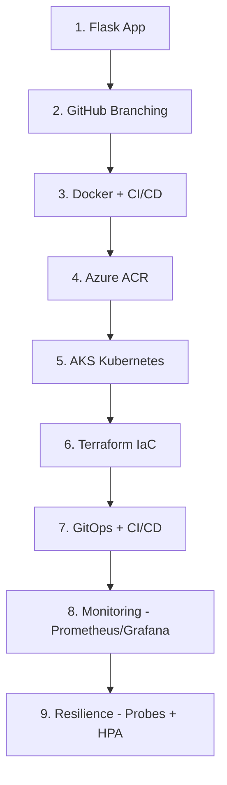

# VehiclePulse — DevOps Curriculum Recap (Stages 1–9)

A hands-on, end-to-end DevOps build using a Flask app (VehiclePulse) to practice the full pipeline: source control, containers, Azure infra, IaC, GitOps, monitoring, and resilience.

## Environment

- Resource group: `vehiclepulse-rg` (Central US)
- Container Registry: `vehiclepulseacr`
- AKS cluster: `vehiclepulse-aks` (created via Terraform, deleted between sessions to control cost)

## Stage-by-Stage Summary

| # | Stage | What we did | Status |
|---|-------|-------------|--------|
| 1 | Flask App | Built the VehiclePulse Flask application as the workload for the whole curriculum. | Done |
| 2 | GitHub Branching | Set up the Git repo and branching workflow (feature → dev → main). | Done |
| 3 | Docker + CI/CD | Containerized the app with a Dockerfile; built a GitHub Actions pipeline to test code and build the Docker image. | Done |
| 4 | Azure ACR | Created Azure Container Registry (`vehiclepulseacr`) and pushed built images to it from the pipeline. | Done |
| 5 | AKS Kubernetes | Deployed an AKS cluster and ran the app on Kubernetes for the first time. | Done |
| 6 | Terraform IaC | Rewrote the AKS cluster as Terraform code (`main.tf`, `variables.tf`, `provider.tf`); compared `terraform apply` (~4 min) vs. manual Portal setup (~15 min). | Done |
| 7 | GitOps + CI/CD | Created an Azure Service Principal for GitHub Actions auth, stored credentials as GitHub Secrets, and extended the pipeline to scan the image (Trivy), push to ACR, then auto-deploy to AKS via `kubectl set image`. | Done |
| 8 | Monitoring | Installed Prometheus + Grafana via Helm (`kube-prometheus-stack`), attached ACR to AKS, exposed the app via a LoadBalancer service, and viewed live dashboards through a Grafana port-forward. | Done |
| 9 | Resilience & Auto-scaling | Added liveness/readiness probes and a Horizontal Pod Autoscaler (3–10 replicas, 80% CPU target); load-tested with `ab` and watched pods scale live in `kubectl` and Grafana. | Done |

## Flow Chart

## Key Pipeline (Stage 7 onward)
## Key Takeaway

Each stage builds directly on the last: source control enables CI, containers enable ACR/AKS, Terraform makes the cluster reproducible, GitOps automates deployment on every push, and monitoring + HPA make the running system observable and self-healing under load.

## Cost Notes

- AKS cluster (`vehiclepulse-aks`) is deleted after every session (`terraform destroy` or `az aks delete`) — running cost is ~$70/month if left up.
- No active cluster = no compute cost between sessions; ACR persists (low storage-only cost).
